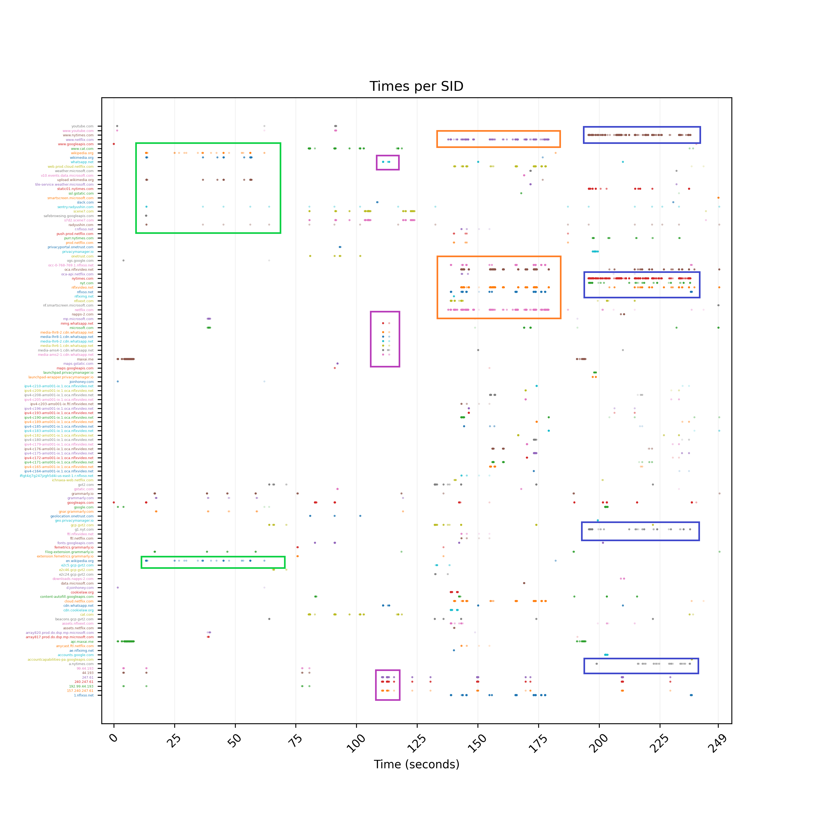
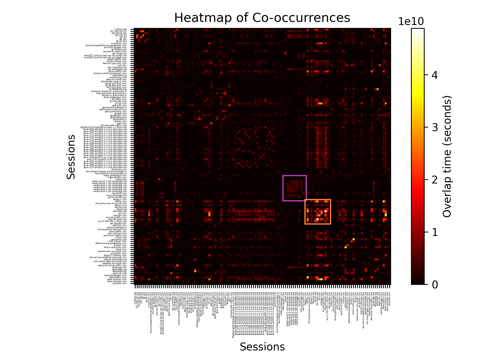
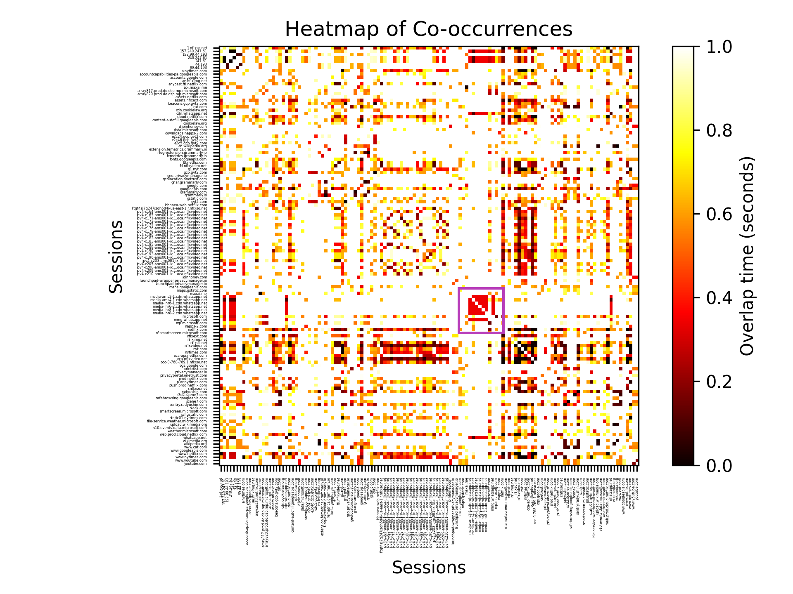
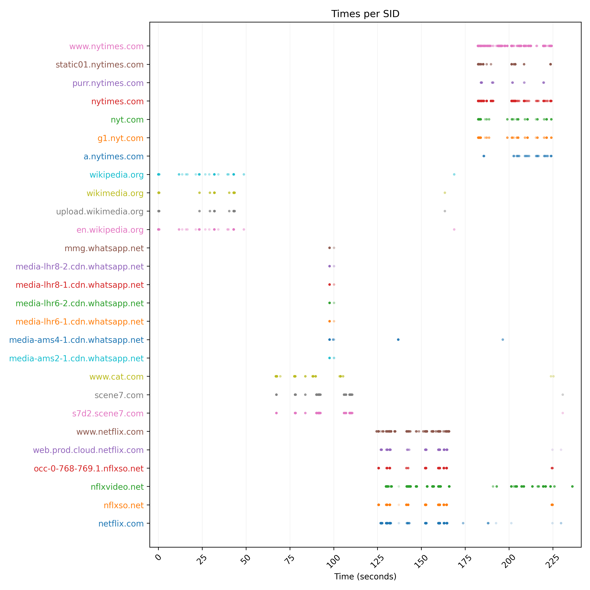
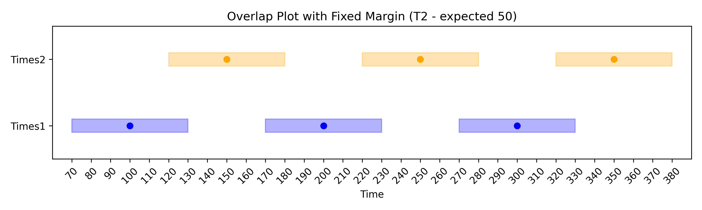
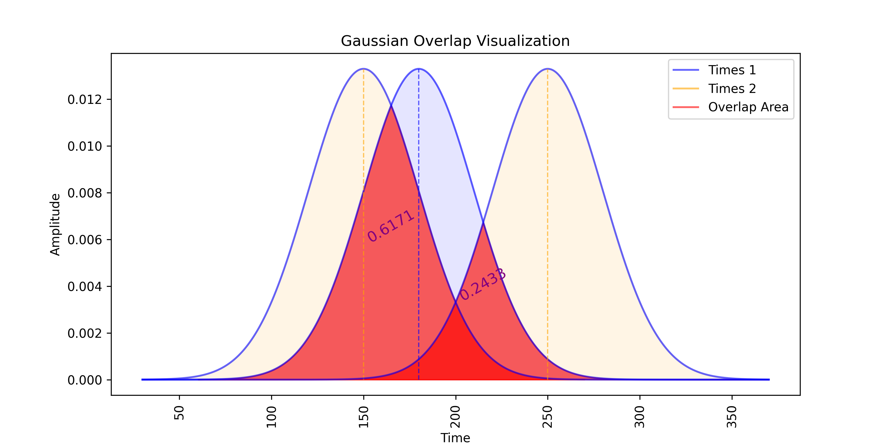
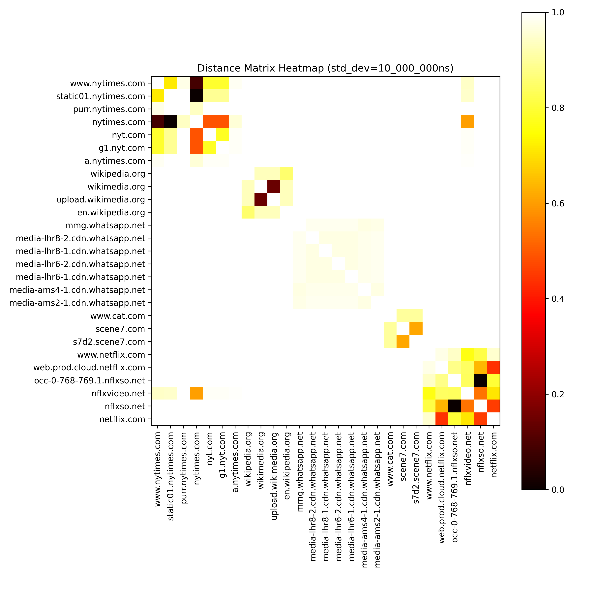
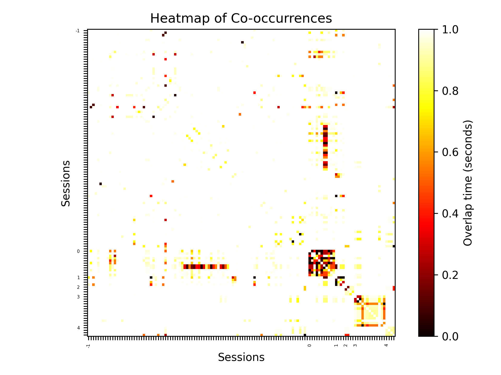
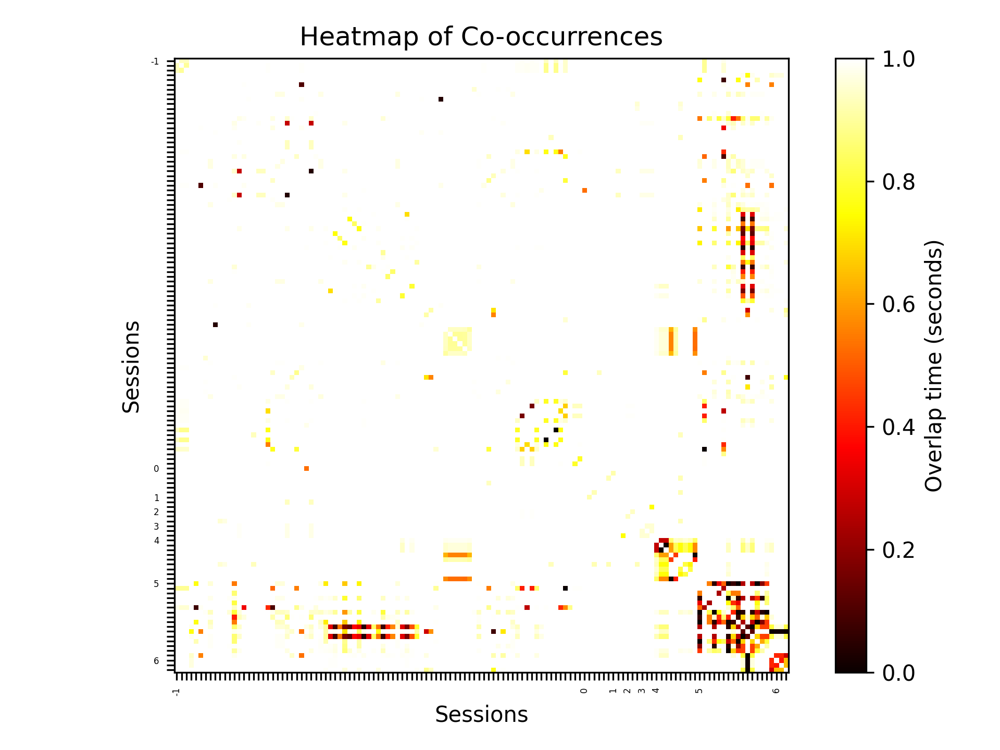
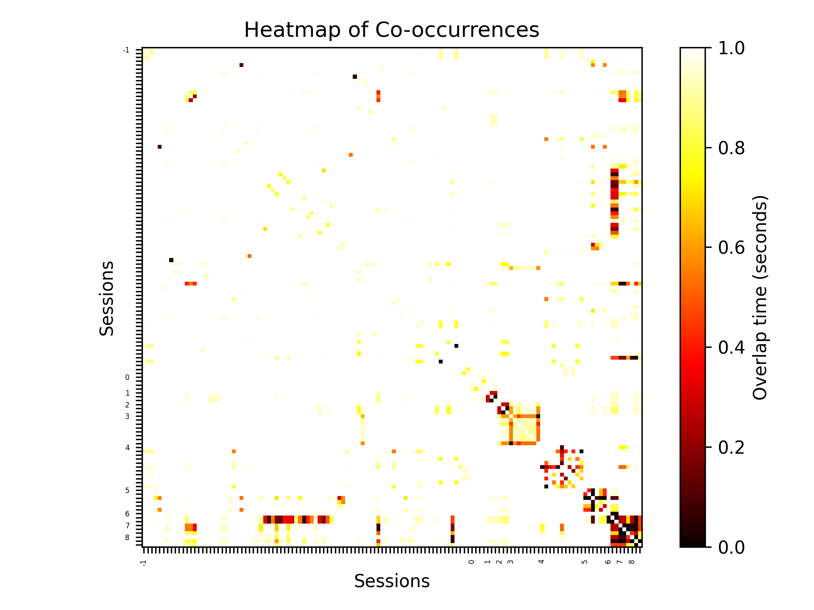

# User Traffic Categorization through On-Device Clustering: Empowering Privacy and Control

When you browse the internet or use an app on your phone, a significant portion of your traffic is not related to the content or services you’re accessing. Websites and apps often include elements from third-party services, such as analytics providers, content delivery networks, and advertising networks. These third parties can track your behavior, collect data on your browsing habits, and even influence where your data is routed. Often, users aren’t fully aware of this data-sharing, which can impact privacy and online experiences.

In this article, we aim to tackle this issue by exploring an approach that categorizes the web traffic of users by the website/app they are using as well as if any third parties are involved. Thus, giving users a clear view of who is interacting with their data and allowing them to make informed choices on how it flows, promoting transparency and giving control back to the user.

## Understanding The Problem and Constraints

To start, let’s look at what we’re trying to solve and the data we can work with. As a VPN, the URnetwork app has access to all of a user’s internet traffic. The goal is to use this traffic data to help users better understand how their data is being accessed and enable them to control this flow of data effectively.

To give users a clear picture of their traffic patterns, we need to **identify the applications they use and categorize any third-party connections**, such as ads, analytics, or other services. This information enables users to make informed choices about their data—for example, blocking specific third parties. This could also allow them to save profiles for apps, such as, "when I'm using this app, always route my traffic through a certain country." Additionally, we want to guarantee that user traffic is never shared with unauthorized parties. An easy way to achieve this is by developing a solution that works **entirely on-device**. This ensures privacy by keeping the user’s information confidential and under their control.

We also chose to avoid deep packet inspection (DPI) because users generate a vast amount of data daily, and processing it all on-device would be computationally expensive, potentially infeasible under a time constraint, and certainly raise privacy concerns. Avoiding DPI means we need to find a way to categorize traffic without actually looking into what users are sending or receiving. Hence, we will **only consider the headers of packets** as available information.

This defines our problem and constraints—**identify the applications users use and categorize any third-party connections entirely on-device only considering the headers of packets**. Since URnetwork is written in `go`, we decided to build our solution in `go`. The source code can be found [here](https://github.com/bringyour/connect/tree/inspect-occurrence-data/inspect).

## First Steps

First, we need to define the input data. Since this project is meant to be used within URnetwork, which already parses the packets of a user for routing, we can get the input data in any format. The main idea is that packets are part of transport sessions (TCP, UDP, etc.), so we can try and group them in this manner. For this, we employ [protocol buffers](https://protobuf.dev/) (`protobuf`), as they are a language-neutral way of serializing data in a compact manner.

We define four transport messages that correspond to the different packet types in a session:
- `TransportOpen` - this is the opening message; if the session is a TLS one, we can also extract the name of the server with which the user is communicating (domain name).
- `TransportClose` - this is the closing message; here, we also have information on why the connection was closed (error, timeout, etc.).
- `WriteDataChunk` - this is application data sent by the client.
- `ReadDataChunk` - this is application data received by the client.

Hence, now we represent a transport session using a collection of the four message types where we expect each session to have at least a `TransportOpen`. All the other message types can be missing, e.g., if the session has not finished or there is no flow of application data. We can also add an ID for each different session to query them easily. For this, we decide to use [`ulid`](https://github.com/ulid/spec) as they can be monotonically ordered and can be sorted even when generated within a millisecond. Furthermore, they are case insensitive and do not use special characters.

As already mentioned, in the final version, URnetwork will provide the `protobuf` transport messages that we work with. However, for this preliminary implementation (and for simpler testing), we need to be able to transform packets in an easier way. For this, we decide to use [`pcap`](https://en.wikipedia.org/wiki/Pcap) files, as they are a standardized packet capture format across platforms. So we implement a function that can parse `pcap` files into our transport records. From now on, we can safely assume that we work only with transport messages, as any `pcap` file can be converted into them.

## Interpreting the Data

Currently, we have a collection of transport sessions where each consists of different transport messages, but how can we interpret this data for our needs? Well, our main goal is to relate the different sessions to each other to try and figure out the ones that are part of the same application. This is a perfect use case for clustering. Most clustering algorithms work using the distance between the different input points. We, however, have sessions (and their packets), so we need to make our own relation that can be used as distance.

The first idea that comes to mind is to define each session by the times at which the packets were sent, as it can be expected that sessions relating to the same application will be active during the same intervals of time. So we extract, for each session, a list of times (corresponding to the send/receive time of the packets) and compare them.

### Sessions Comparison

Now, the question is, how can we compare two sessions? Let's say that `sessionA` was active at `timeA`, and `sessionB` was active at `timeB`. Do we count this as a match between the sessions only if `timeA = timeB`, or if the two times have a 1-second difference, or somehow else entirely? Let's, for now, take the simplest approach—two times count as **overlapping** if they are within 1 second of each other. Then, we define the **total overlap** to be the number of pairs of times between the two sessions that overlap. For example, if we have sessions with times `[10, 15, 17, 18]` and `[11, 16]`, then the total overlap is 3 because there are 3 pairs that overlap (`<10, 11>`, `<15, 16>`, `<17, 16>`). We will later explore other approaches that might be better for overlap calculation.

### Domain Interpretation

Another piece of information that we don't fully use is the domain names of each session. As each domain can be broken down into hierarchical levels (top-, second-, third-level domains), we could potentially group sessions based on parent domains. For instance, `ipv4-abc.1.api.urnetwork.com` can be split into `api.urnetwork.com`, `urnetwork.com`, and `.com` as parent domains. So then, for example, if we encounter `api.urnetwork.com` and `vpn.urnetwork.com`, we can store their times separately as expected, but also group them under `urnetwork.com`. This approach allows us to relate sessions originating from the same parent domain better. Furthermore, if two domains that share the same parent domain are not related, this might prove that one (or both) of them is a third party that cannot be correlated to the bigger parent domain group. Note, we intentionally ignore top-level domains (like `.com`), as they are too general to provide meaningful relations. Thus, we split each domain into a second- and a third-level domain and aggregate times that share the same parent domain.

## Test Data

Before we move on to clustering, we need to generate some test data that we can use to visualize and verify our results. For this, we record in WireGuard a session where we go through a bunch of websites in a browser and note when we open a website and when we exit it (used for verifying later). The session is saved in a `pcap` file and then parsed into transport messages. For this article, we will go with a smaller example where we browsed Wikipedia for a bit, then CAT.com, then watched some Netflix, and finally read some news on The New York Times (in total ~4 minutes of capture). The times can be seen below:

As we can see, there are several times that seem to correlate. For example, in green we see domain names for Wikipedia, in purple there seems to be some traffic for WhatsApp (which was running in the background at the time of recording the test session), in orange are Netflix-related domains, and in blue - New York Times. In the future, we can use these related times to verify our clustering by checking if they are grouped together in the same cluster.

## Overlap and Distance

Let's try and visualize the overlap between the times:

Here, we can clearly see the relation between the Netflix domains in orange, vaguely between the WhatsApp domains in purple, and for the other domains, relations are harder to spot. So we should improve our overlap calculation. But before we start changing it, let's move on to the actual values that we need for clustering - distances.

We need to map our overlap values to distance, i.e., higher overlap means less distance and lower overlap means more distance. Additionally, to account for outliers, the smaller overlaps should be easily distinguishable. We can use an exponential function to achieve this. One such function is exponential decay `e^(-λt)` where `t`, in our case, is normalized overlap (`overlap/max_overlap`), and `λ` is a constant. Additionally, a nice property of this function is that it maps the distance from 0 to 1. Now, let's try and visualize the distance matrix:

Now, we see that the most prominent region is the WhatsApp one (in purple), with the rest being somewhat recognizable. So we have not made any improvements to our distance relation.

The results from the overlap and distance matrix might indicate that our underlying overlap function is not good at estimating the relationships. So let's try and pick out the most prominent clusters from the times plot and isolate them. We are left with these:

We have, in order: New York Times, Wikipedia, WhatsApp, CAT.com, and Netflix. Now, we can try using different overlap functions to find the best-fitting one. Currently, our approach counts the overlaps of pairs within one second. We can, however, move from this approach and try to represent each time as a continuous interval in time. Then, we can actually count the total overlap in seconds between the intervals. We call this `Fixed Margin Overlap`. For example, below we see the times `[100, 200, 300]` and `[150, 250, 350]` with a margin of `30` to the left and right. If we count, the total overlap is 50. Here, we also make sure not to double count if intervals from the same session (list) intersect. This algorithm is also known as a [sweep line algorithm](https://dilipkumar.medium.com/sweep-line-algorithm-e1db4796d638).

Another approach would be to use some drop-off at the ends of the intervals so that closer times count for more overlap. We can use a Gaussian distribution for this. For example, below we get the times `[180]` and `[150, 250]` with a standard deviation of 30. We then calculate the overlap between each time from the first list (blue) with each time from the second list (yellow). Here, we decide to "double" count the intersecting distributions, as there is a drop-off, and a time overlapping both intersecting distributions should have a higher overlap than overlapping just one. Also, another measure we implement is a hard cutoff, which is a length in time larger than which we do not count overlaps. This tries to eliminate cases where we calculate the total overlap (as it needs to calculate the area below the curves) for very small values of overlap. A safe value for this is `4*standard deviation`, as that includes 99.99% of the original distribution.

Now we have two approaches that we can use: fixed margin and Gaussian overlap, each with a different parameter - margin and standard deviation, respectively. After some experimenting, we figure out that the best value for the parameters is around 0.01s or 10ms. This is a good middle ground between speed and accuracy, as the overlap calculation using the Gaussian method becomes slower with bigger parameter values. Below is the distance matrix for the previously shown subset of times where we see the relationships clearly outlined.

As a final note on which approach is better, we currently have not seen big differences between the two approaches. Sometimes Gaussian overlap produces better results than fixed margin but not by much. So we advise using fixed margin if speed is of high importance; otherwise, Gaussian is the safer choice. Furthermore, we have a `python` script that compares different parameter values. This script can be used in the future to figure out the best value for the parameters. Lastly, we explored using other functions to convert from overlap to distance, but we have not included a discussion on our choice of using exponential decay for brevity and to maintain focus on the core concepts presented in this article.

## Clustering

At long last, we have everything we need to cluster the data. The question now is which clustering algorithm to choose. For this, we need to define the characteristics of our data. It is non-linear, with most values near 1 (max distance). The formed clusters are heterogeneous (different shape, size, and density) of an unknown amount with possibly unclustered points. Based on these characteristics, we decide that the best options for a clustering algorithm are HDBSCAN and OPTICS, as both are not sensitive to outliers, can form heterogeneous clusters of different densities, and leave some points unclustered. Additionally, the two methods we chose have quite similar parameters, with the main ones being relatively easy to choose. [This page](https://scikit-learn.org/stable/auto_examples/cluster/plot_cluster_comparison.html) shows a nice visualization of different clustering approaches to get an intuition behind their pros and cons.

Now, let's try and cluster using the two approaches. To build the distance matrix, we choose to use Gaussian overlap with a standard deviation of 10ms as per the results of the last section. We also need to choose the constant `λ` for the exponential decay. After some testing, we find that when using OPTICS, a large value (we use `λ=150`) is needed to exaggerate the differences between the smaller overlap values. For HDBSCAN, the decay value does not matter (as long as it is bigger than 1) as HDBSCAN is actually an algorithm that builds upon DBSCAN by finding the most optimal value (in a quite efficient manner) for one of its parameters (`ε`), which is normally quite unintuitive to choose. Thus, the rate of decay `λ` for HDBSCAN doesn't matter as changing `λ` changes the optimal `ε` value, but HDBSCAN will still choose the correct one, which will ultimately produce the same clustering. The main advantage of having a bigger `λ` in general is that the differences are exaggerated, so it is easier to visualize the relationships between the sessions.

Next, to cluster, we need to choose the main (intuitive) parameter for each algorithm, which is the minimum size at which a cluster will form. Normally, this would be 2, as any two related sessions should be clustered, but since we also include parent domains, we make it 3. Also, both approaches put the unclustered domains together in a cluster with `ID=-1` to indicate that they are unclustered. Now, after running the clustering for OPTICS, we get 6 clusters:

| ClusterID | Domains                                                                                                                                                                                                                                                                                                                 |
| --------- | ----------------------------------------------------------------------------------------------------------------------------------------------------------------------------------------------------------------------------------------------------------------------------------------------------------------------- |
| -1        | 92 unclustered domains                                                                                                                                                                                                                                                                                                  |
| 0         | '1.nflxso.net', 'cloud.netflix.com', 'cookielaw.org', 'netflix.com', 'nflxext.com', 'nflxso.net', 'nflxvideo.net', 'oca.nflxvideo.net', 'occ-0-768-769.1.nflxso.net', 'web.prod.cloud.netflix.com', 'www.netflix.com'                                                                                                   |
| 1         | 'nytimes.com', 'privacymanager.io', 'static01.nytimes.com', 'www.nytimes.com'                                                                                                                                                                                                                                           |
| 2         | 's7d2.scene7.com', 'scene7.com', 'www.youtube.com', 'youtube.com'                                                                                                                                                                                                                                                       |
| 3         | '157.240.247.61', '240.247.61', '247.61', 'cdn.whatsapp.net', 'media-ams2-1.cdn.whatsapp.net', 'media-ams4-1.cdn.whatsapp.net', 'media-lhr6-1.cdn.whatsapp.net', 'media-lhr6-2.cdn.whatsapp.net', 'media-lhr8-1.cdn.whatsapp.net', 'media-lhr8-2.cdn.whatsapp.net', 'microsoft.com', 'mmg.whatsapp.net', 'whatsapp.net' |
| 4         | '192.99.44.193', '44.193', '99.44.193', 'cat.com'                                                                                                                                                                                                                                                                       |

Which we can visualize as a distance map:

We see that meaningful clusters are formed, namely for Netflix, NY Times, and WhatsApp, as well as some others that we can't be sure of, like scene7/YouTube and cat.com. 92 of the domains remain unclustered.

Running HDBSCAN, we get 8 clusters:

| ClusterID | Domains                                                                                                                                                                                                                                                                                                   |
| --------- | --------------------------------------------------------------------------------------------------------------------------------------------------------------------------------------------------------------------------------------------------------------------------------------------------------- |
| -1        | 85 unclustered domains                                                                                                                                                                                                                                                                                    |
| 0         | 'maps.gstatic.com', 'napps-2.com', 'nf.smartscreen.microsoft.com', 'privacyportal.onetrust.com', 'slack.com', 'smartscreen.microsoft.com'                                                                                                                                                                 |
| 1         | 'downloads.napps-2.com', 'e2c46.gcp.gvt2.com', 'f-log-extension.grammarly.io'                                                                                                                                                                                                                             |
| 2         | 'gnar.grammarly.com', 'grammarly.com', 'mp.microsoft.com'                                                                                                                                                                                                                                                 |
| 3         | 'extension.femetrics.grammarly.io', 'femetrics.grammarly.io', 'grammarly.io'                                                                                                                                                                                                                              |
| 4         | '157.240.247.61', '240.247.61', '247.61', 'cdn.whatsapp.net', 'media-ams4-1.cdn.whatsapp.net', 'microsoft.com', 'tile-service.weather.microsoft.com', 'weather.microsoft.com', 'whatsapp.net'                                                                                                             |
| 5         | '1.nflxso.net', 'cat.com', 'cdn.cookielaw.org', 'cloud.netflix.com', 'cookielaw.org', 'googleapis.com', 'netflix.com', 'nflxext.com', 'nflxso.net', 'nflxvideo.net', 'nytimes.com', 'oca.nflxvideo.net', 'occ-0-768-769.1.nflxso.net', 'web.prod.cloud.netflix.com', 'www.netflix.com', 'www.nytimes.com' |
| 6         | 'g1.nyt.com', 'nyt.com', 'static01.nytimes.com'                                                                                                                                                                                                                                                           |
Which we can visualize as a distance map:

We again see that similar meaningful clusters are formed (Netflix, NY Times, and WhatsApp); however, the other smaller clusters seem to be also well-formed but also maybe split up (2 clusters for Grammarly). Also, the Netflix cluster seems to include some entries for NY Times. Finally, 85 of the domains remain unclustered.

From these first results, we see that both methods form good clusters based on our distance matrix. Comparing the two, it seems that OPTICS is better at finding closely related sessions, whereas HDBSCAN is a bit more lax in what it considers a cluster. However, the more pressing concern is why some clusters were not formed, i.e., the Wikipedia one? There are several possible causes for this:
- The data is too small to form the clusters (it is only ~4 minutes of traffic after all);
- The overlap function used is still not good enough;
- The cluster algorithm's other parameters can be further exploited to achieve better clustering.

Relating to the first issue, we try generating a second dataset that is 3 times bigger and cluster similarly to how we did with the first one. The results seem to be better, with more of the meaningful clusters forming and even HDBSCAN outperforming OPTICS. So we can partially attribute for the "lackluster" first results to the size of the data. Next, we believe that the overlap function that is currently used is good at extracting the prominent features of the data and that, for this preliminary implementation, is sufficient.

As to the final concern, we tried changing the other parameters. For completeness of results, we will go over the results without going into much detail on exactly why certain values provide the best results. For OPTICS, there seem to be some improvements when changing the `max_eps`, but nothing compared to the improvements in HDBSCAN. In HDBSCAN, there is one hyperparameter (`alpha`) that, when reduced to a small value (around `0.001`), we find more meaningful clusters are formed. Additionally, using `cluster_selection_epsilon=0.001` proves to work better for a bigger dataset. [This page](https://hdbscan.readthedocs.io/en/latest/parameter_selection.html) provides some intuition on how to choose values for the parameters of HDBSCAN. Our results with these values (using the initial smaller dataset) are as follows:

| ClusterID | Domains                                                                                                                                                                                                                                             |
| --------- | --------------------------------------------------------------------------------------------------------------------------------------------------------------------------------------------------------------------------------------------------- |
| -1        | 84 unclustered domains                                                                                                                                                                                                                              |
| 0         | 'extension.femetrics.grammarly.io', 'f-log-extension.grammarly.io', 'femetrics.grammarly.io', 'grammarly.io'                                                                                                                                        |
| 1         | 'beacons.gcp.gvt2.com', 'gcp.gvt2.com', 'gvt2.com'                                                                                                                                                                                                  |
| 2         | '157.240.247.61', '240.247.61', '247.61'                                                                                                                                                                                                            |
| 3         | 'cdn.whatsapp.net', 'media-ams2-1.cdn.whatsapp.net', 'media-ams4-1.cdn.whatsapp.net', 'media-lhr6-1.cdn.whatsapp.net', 'media-lhr6-2.cdn.whatsapp.net', 'media-lhr8-1.cdn.whatsapp.net', 'media-lhr8-2.cdn.whatsapp.net', 'whatsapp.net'            |
| 4         | 'accountcapabilities-pa.googleapis.com', 'cat.com', 'content-autofill.googleapis.com', 'en.wikipedia.org', 'fonts.googleapis.com', 'googleapis.com', 's7d2.scene7.com', 'safebrowsing.googleapis.com', 'scene7.com', 'wikipedia.org', 'www.cat.com' |
| 5         | 'g1.nyt.com', 'nyt.com', 'nytimes.com', 'privacymanager.io', 'static01.nytimes.com', 'www.nytimes.com'                                                                                                                                              |
| 6         | 'ipv4-c182-ams001-ix.1.oca.nflxvideo.net', 'nflxvideo.net', 'oca.nflxvideo.net'                                                                                                                                                                     |
| 7         | '1.nflxso.net', 'nflxso.net', 'occ-0-768-769.1.nflxso.net'                                                                                                                                                                                          |
| 8         | 'cloud.netflix.com', 'netflix.com', 'www.netflix.com'                                                                                                                                                                                               |
Which we can visualize as a distance map:

We see that now 10 clusters are formed where the unclustered sessions remain about the same (84 compared to 85 previously). So what we have achieved using all the parameters is to split the previously bigger clusters into smaller, more meaningful ones, as well as find some other well-defined clusters. Based on these results (and also looking at the bigger dataset), we find that HDBSCAN is better to use as it makes a higher amount of smaller clusters compared to OPTICS (which makes bigger clusters in general, resulting in more of the data being unclustered). We should note, however, that our two datasets are still not very big, so it is possible that a different conclusion is drawn when testing with more data. This concludes the main analysis of this article.

## Conclusion

In this article, we outlined our approach on clustering transport sessions of packets such that similar sessions are clustered together. We defined a method to relate the sessions using the time of each packet. We further analyzed several approaches to calculate the relationships between sessions, including fixed margin overlap and Gaussian overlap. Both approaches represent the time of each packet as a continuous interval and calculate the total overlap between pairs of times of different sessions. We then proposed a method, exponential decay, to convert the overlap values to distance values that can be used to cluster the sessions.

Finally, we evaluated two algorithms, HDBSCAN and OPTICS, by using them to cluster a small test dataset. We conclude that the two methods are quite similar in results, producing well-defined and meaningful clusters. When tweaking the hyperparameters, we find that HDBSCAN outperforms OPTICS in terms of finding more and smaller clusters. This, however, can be due to our relatively small test data, so a final conclusion cannot be drawn until further analysis is performed using more traffic data.

## Discussion and Future Work

Our main goal was to "**identify the applications users use and categorize any third-party connections entirely on-device only considering the headers of packets**." We showed that identifying the application/websites used can be achieved by grouping them into clusters. However, we have not directly addressed how to identify third-parties; hence, we theorize an approach that uses the results from the clustering to achieve this. As we split the domain of a session into parent domains, we can use these parent domains and the unclustered sessions to identify third-parties. If a session has sufficient overlap with other sessions but is still left unclustered, we might consider this session as a third-party. Additionally, if there is a small cluster where most of the sessions have parent domains that are either unclustered or clustered in another cluster, then we can consider the small cluster as a third-party cluster. Thus, in a future implementation of our approach, we believe there is enough information in the current results to obtain the third-parties present in the dataset.

Another aspect we did not consider during our exploration is the memory that this approach is using, as with more data, more space is needed, which might not be feasible, especially on certain mobile devices. Thus, we briefly discuss a technique that can be used in the future to reduce the amount of space needed to store our distance matrix. Currently, the distance matrix is stored as a sparse matrix. This approach, however, makes it so we do not know the actual size this sparse matrix takes before we start parsing the transport sessions and calculating the overlap. One method that can be used is [count-min sketch](https://en.wikipedia.org/wiki/Count%E2%80%93min_sketch). With count-min sketch, we can build a fixed-size matrix that is probabilistic in nature with several guarantees on how close the estimated values are to the real ones (this data structure can only overestimate values). After a small test, we believe there is potential in this technique for achieving what we strive for.

Finally, we compose a short list of the directions where this project can go in the future:
- More efficient implementation of the clustering algorithm;
- Use more of the data in the packet headers, e.g., size of the packet;
- Optimize memory usage of clustering;
- Technique for extracting third-parties;
- Compose bigger test data.

The next section outlines some specific challenges we encountered during development as well as how we use tests in our approach.

## Challenges and Testing

During the development of our solution, we tried and tested different approaches for many parts of the project. As already mentioned, there are 2 implementations for overlap functions, and we tried using other distance functions but ultimately decided on using exponential decay. Additionally, as `go` did not provide many options for clustering algorithms, we initially used `python` to figure out which approach is best. So all the clustering in this article was done using the [`scikit-learn`](https://scikit-learn.org/stable/) library. However, after figuring out that HDBSCAN is the clustering method we want to go for, we found a `go` implementation, and that is what is currently used in our code. This `go` implementation, however, did not have all the parameters the `python` one had, so the clustering results are not as good as the `python` ones (but not by a lot). Our code can be found [here](https://github.com/bringyour/connect/tree/inspect-occurrence-data/inspect), where we have left the `python` scripts to cluster if needed in the future. The [README](https://github.com/bringyour/connect/blob/inspect-occurrence-data/inspect/README.md) further explains all of the functionalities of the created module. There are several other `python` scripts that were used to create the visualizations of this article that can be used to understand the data and the steps of the solution.

Lastly, we developed 2 testing methodologies and an evaluation technique to help with the assessment of the two clustering algorithms. First, we developed a genetic hill climbing algorithm to find the best parameter values for OPTICS and HDBSCAN. Second, we defined test cases for our test sessions consisting of clusters we expect the clustering to be able to find with high accuracy. Third, we defined a not-so-precise evaluation function to give us an idea of how the clustering is performing without the need to manually examine it every time. All of these methods are further explained in the [README](https://github.com/bringyour/connect/blob/inspect-occurrence-data/inspect/README.md) of the source code.